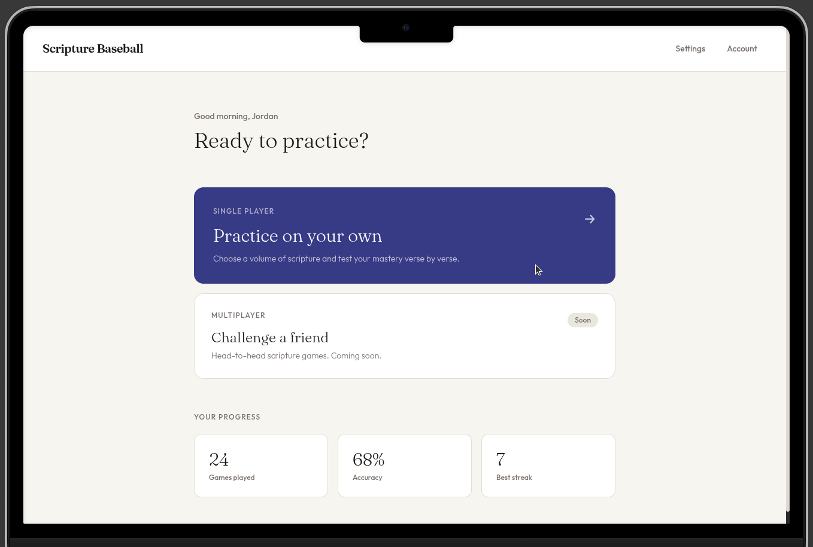
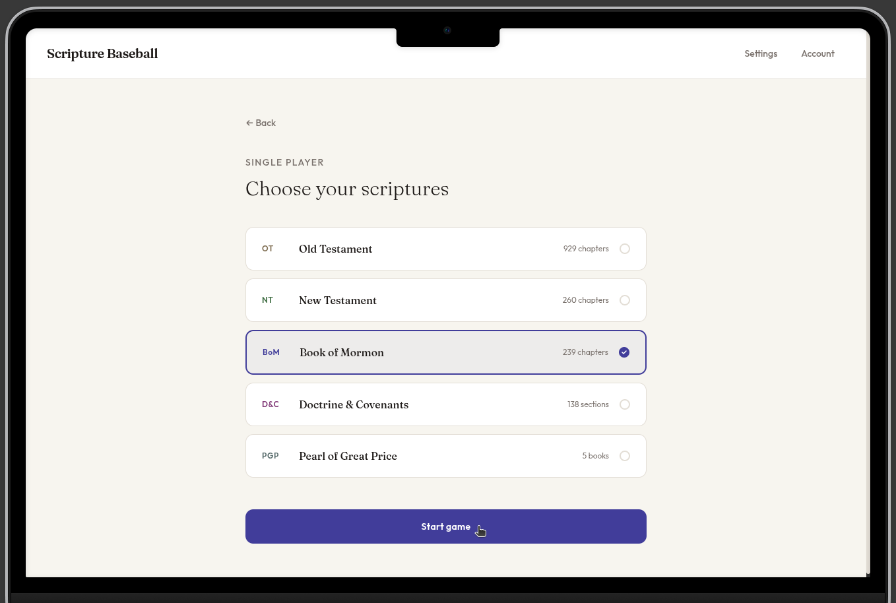
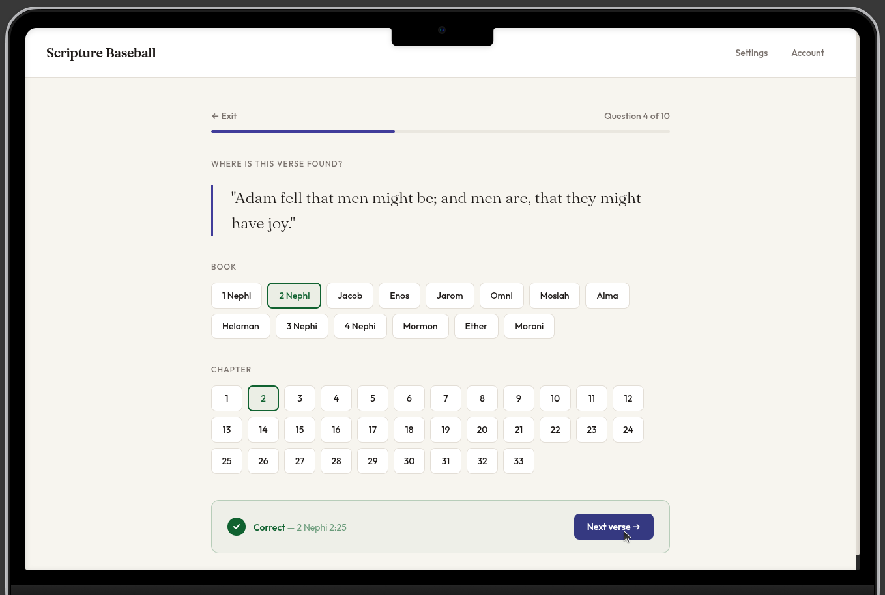
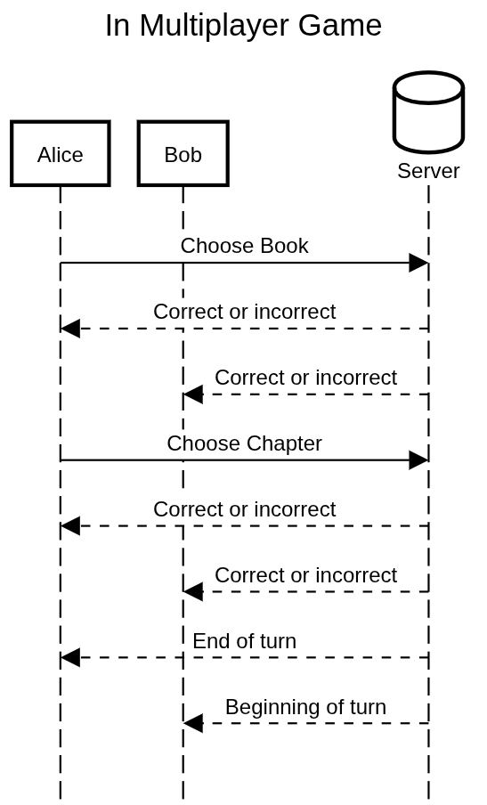

# Scripture Baseball

[My Notes](notes.md)

Scripture Baseball is an interactive web app in which players test their scriptural knowledge by playing a variety of single-player or multi-player games based on the Standard Works of The Church of Jesus Christ of Latter-day Saints. The basic game presents a random verse to the user, after which they attempt to guess the book and chapter in which that verse is found. 

> [!NOTE]
> This is a template for your startup application. You must modify this `README.md` file for each phase of your development. You only need to fill in the section for each deliverable when that deliverable is submitted in Canvas. Without completing the section for a deliverable, the TA will not know what to look for when grading your submission. Feel free to add additional information to each deliverable description, but make sure you at least have the list of rubric items and a description of what you did for each item.

> [!NOTE]
> If you are not familiar with Markdown then you should review the [documentation](https://docs.github.com/en/get-started/writing-on-github/getting-started-with-writing-and-formatting-on-github/basic-writing-and-formatting-syntax) before continuing.

### Elevator pitch

Are you a returned missionary who no longer has a physical copy of scriptures with you at all times? Do you just want to improve your scriptural knowledge? Scripture Baseball lets you master the scriptures by yourself and with friends. You can choose a specific book to practice or challenge someone else. You'll get a verse and try to remember where it's at. You can practice books you don't know as well and have fun!

### Design

#### Logged In:

#### Choose Your Book:

#### In Game:

Here is a simple diagram showing a multi-player game:

### Key features

- Secure HTTPS login
- Ability to choose single-player and multi-player games
- Ability to choose which books to practice
- Multi-player displays scores and player choices in real-time
- Scores and streaks are persistently stored

### Technologies

I am going to use the required technologies in the following ways.

- **HTML** - Use correct HTML structure for each of the site's pages. The following pages will use HTML:
    - Logging in
    - Dashboard
    - Single-player game
    - Multi-player game
    - Account/settings
- **CSS** - CSS will be used to style the webpages and make them look good on different screen sizes. It will also be used for any coloring or animation within gameplay.
- **React** - React will be used to route the user to the various pages described above in the HTML section. It will be used to effectively modularize the code.
- **Service** - The following services will be employed:
    - Signup
    - Login
    - Open various pages while logged in
    - Connect to a game
    - Guess a book/chapter
    - Use of Google Analytics as a third-party API to determine from what devices and in what general locations users are accessing the web app
- **DB/Login** - Description here
- **WebSocket** - Description here

HTML - Uses correct HTML structure for application. Two HTML pages. One for login and one for voting. Hyperlinks to choice artifact.
CSS - Application styling that looks good on different screen sizes, uses good whitespace, color choice and contrast.
React - Provides login, choice display, applying votes, display other users votes, and use of React for routing and components.
Service - Backend service with endpoints for:
login
retrieving choices
submitting votes
retrieving vote status
DB/Login - Store users, choices, and votes in database. Register and login users. Credentials securely stored in database. Can't vote unless authenticated.
WebSocket - As each user votes, their votes are broadcast to all other users.

HTML - Basic structural and organizational elements
CSS - Styling and animating
React - Frontend code to interact with a user, represent functionality with components, and route what is displayed using JavaScript and the React web framework. React helps you to modularize your code into components that represent things like a login form, a picture card, or an interactive part of a game. The routing that React provides changes what is displayed to the user based upon the actions they take. For example, after logging in, React would change the display from the login component, to the gameplay component.
Service - Backend server functionality for the following:
Multiple endpoints (server function calls) that provide functionality necessary to support your application. For example, storing scores, retrieving user preferences, or generating dynamic content.
Support for login, logout, and registering users.
At least one call to a third party (e.g. that you didn't write) service endpoint to do something like suggest a color pallette, get a joke, get the weather, or get images. You can view a list of APIs here: https://github.com/public-apis/public-apis. You can make most services work, but the easiest ones to use don't require authentication, support CORS, and require HTTPS.
Database: A rendering of application data that is stored in the database. For Simon, this is the high scores of all players.
WebSocket: A rendering of data that is received from your server. This may be realtime data sent from other users (e.g. chat or scoring data), or realtime data that your service is generating (e.g. stock prices or latest high scores). For Simon, this represents every time another user creates or ends a game.

## 🚀 Specification Deliverable

> [!NOTE]
> Fill in this sections as the submission artifact for this deliverable. You can refer to this [example](https://github.com/webprogramming260/startup-example/blob/main/README.md) for inspiration.

For this deliverable I did the following. I checked the box `[x]` and added a description for things I completed.

- [ ] I completed the prerequisites for this deliverable (Git commit requirement)
- [ ] Proper use of Markdown
- [ ] A concise and compelling elevator pitch
- [ ] Description of key features
- [ ] Description of how you will use each technology including your 3rd party API and use of WebSocket
- [ ] One or more rough sketches of your application. Images must be embedded in this file using Markdown image references.

## 🚀 AWS deliverable

For this deliverable I did the following. I checked the box `[x]` and added a description for things I completed.

- [ ] **Rented EC2 server** - I did not complete this part of the deliverable.
- [ ] **Leased domain name** - I did not complete this part of the deliverable.
- [ ] **Server accessible** from my domain: [https://yourdomainnamehere.click](https://yourdomainnamehere.click) - I did not complete this part of the deliverable.

## 🚀 HTML deliverable

For this deliverable I did the following. I checked the box `[x]` and added a description for things I completed.

- [ ] I completed the prerequisites for this deliverable (Simon deployed, GitHub link, Git commits)
- [ ] **HTML pages** - I did not complete this part of the deliverable.
- [ ] **Proper HTML element usage** - I did not complete this part of the deliverable.
- [ ] **Links** - I did not complete this part of the deliverable.
- [ ] **Text** - I did not complete this part of the deliverable.
- [ ] **3rd party API placeholder** - I did not complete this part of the deliverable.
- [ ] **Images** - I did not complete this part of the deliverable.
- [ ] **Login placeholder** - I did not complete this part of the deliverable.
- [ ] **DB data placeholder** - I did not complete this part of the deliverable.
- [ ] **WebSocket placeholder** - I did not complete this part of the deliverable.

## 🚀 CSS deliverable

For this deliverable I did the following. I checked the box `[x]` and added a description for things I completed.

- [ ] I completed the prerequisites for this deliverable (Simon deployed, GitHub link, Git commits)
- [ ] **Visually appealing colors and layout. No overflowing elements.** - I did not complete this part of the deliverable.
- [ ] **Use of a CSS framework** - I did not complete this part of the deliverable.
- [ ] **All visual elements styled using CSS** - I did not complete this part of the deliverable.
- [ ] **Responsive to window resizing using flexbox and/or grid display** - I did not complete this part of the deliverable.
- [ ] **Use of a imported font** - I did not complete this part of the deliverable.
- [ ] **Use of different types of selectors including element, class, ID, and pseudo selectors** - I did not complete this part of the deliverable.

## 🚀 React part 1: Routing deliverable

For this deliverable I did the following. I checked the box `[x]` and added a description for things I completed.

- [ ] I completed the prerequisites for this deliverable (Simon deployed, GitHub link, Git commits)
- [ ] **Bundled using Vite** - I did not complete this part of the deliverable.
- [ ] **Components** - I did not complete this part of the deliverable.
- [ ] **Router** - I did not complete this part of the deliverable.

## 🚀 React part 2: Reactivity deliverable

For this deliverable I did the following. I checked the box `[x]` and added a description for things I completed.

- [ ] I completed the prerequisites for this deliverable (Simon deployed, GitHub link, Git commits)
- [ ] **All functionality implemented or mocked out** - I did not complete this part of the deliverable.
- [ ] **Hooks** - I did not complete this part of the deliverable.

## 🚀 Service deliverable

For this deliverable I did the following. I checked the box `[x]` and added a description for things I completed.

- [ ] I completed the prerequisites for this deliverable (Simon deployed, GitHub link, Git commits)
- [ ] **Node.js/Express HTTP service** - I did not complete this part of the deliverable.
- [ ] **Static middleware for frontend** - I did not complete this part of the deliverable.
- [ ] **Calls to third party endpoints** - I did not complete this part of the deliverable.
- [ ] **Backend service endpoints** - I did not complete this part of the deliverable.
- [ ] **Frontend calls service endpoints** - I did not complete this part of the deliverable.
- [ ] **Supports registration, login, logout, and restricted endpoint** - I did not complete this part of the deliverable.
- [ ] **Uses BCrypt to hash passwords** - I did not complete this part of the deliverable.

## 🚀 DB deliverable

For this deliverable I did the following. I checked the box `[x]` and added a description for things I completed.

- [ ] I completed the prerequisites for this deliverable (Simon deployed, GitHub link, Git commits)
- [ ] **Stores data in MongoDB** - I did not complete this part of the deliverable.
- [ ] **Stores credentials in MongoDB** - I did not complete this part of the deliverable.

## 🚀 WebSocket deliverable

For this deliverable I did the following. I checked the box `[x]` and added a description for things I completed.

- [ ] I completed the prerequisites for this deliverable (Simon deployed, GitHub link, Git commits)
- [ ] **Backend listens for WebSocket connection** - I did not complete this part of the deliverable.
- [ ] **Frontend makes WebSocket connection** - I did not complete this part of the deliverable.
- [ ] **Data sent over WebSocket connection** - I did not complete this part of the deliverable.
- [ ] **WebSocket data displayed** - I did not complete this part of the deliverable.
- [ ] **Application is fully functional** - I did not complete this part of the deliverable.
